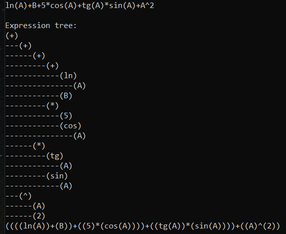
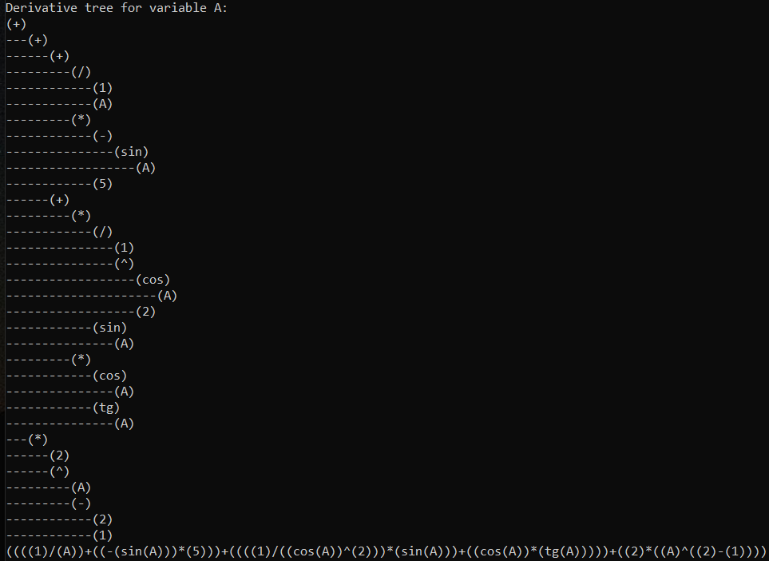
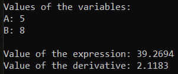

# DerivativeCalculator
- Calculating derivative of expression using binary tree in C++
- Calculating value of expression and its derivative based on values of variables
- Supports cosine, sine, natural log and tangent
- Higher order derivatives

